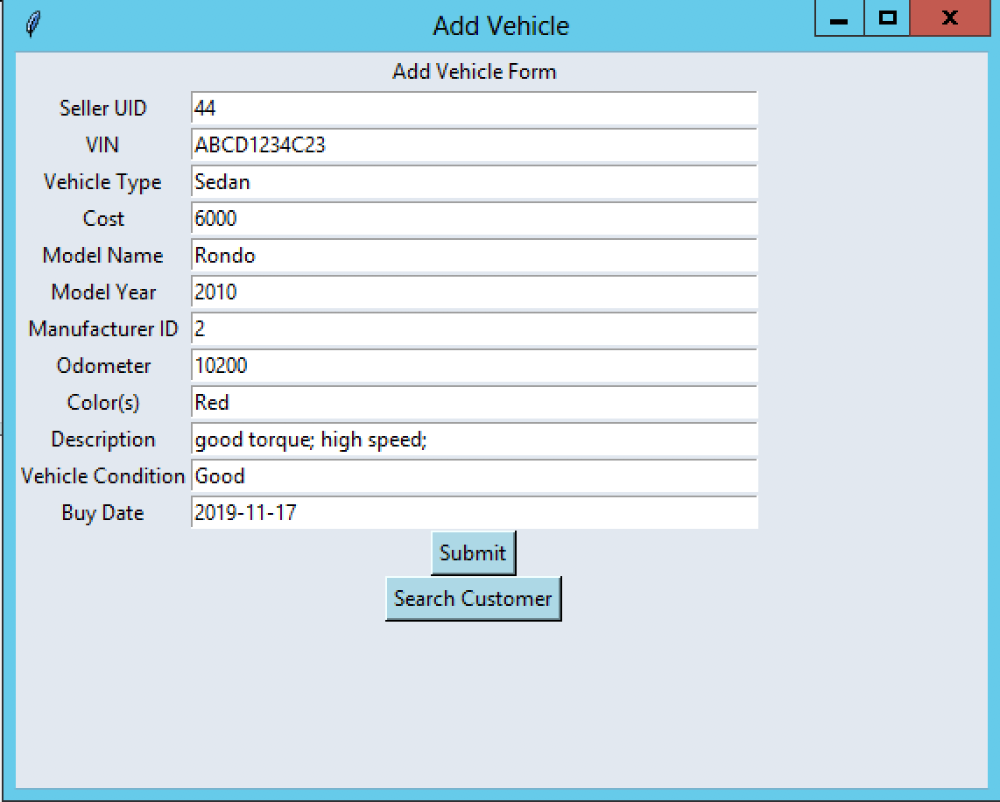
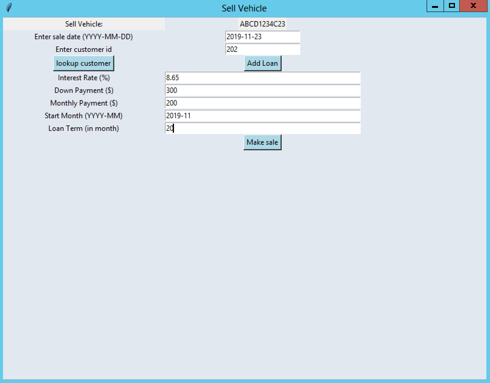

## Descritpion:  

This is a DB Project, completed as part of the DB Design and Concepts Course. 
The goal of this project was to implement a DBMS system for a use case of Used Car Shop. In this system, there are multiple users like Clerks, Salesperson, Managers, and Owner. The system keeps track of Vehicles in the inventory and facilitates users to do their tasks through the system as per their privileges. The system also can generate reports for Owner and Manager users regarding the sales, loan incomes, parts orders for vehicles, ragarding performance of sales-person, etc.

The group project was completed in following III phases: 
#### Phase I:
Designing of EER (Entity Relationship Diagram), IFD (Information Flow Diagram) and Abstract code for tasks per user.  
#### Phase II:
DB Schema Desinging, updation of EER as per the feedback and review comments and SQL query writing as per the task requirements.
#### Phase III:
DB creation as per the PhaseII, implemention of bussiness logic and UI as per the requirements.
The DB Application was Designed for Used Car Shops' DB Management

### Technologies Used: 
Database: MySQL
Python for Backend programming
Tkinter for GUI

### Application GUI   

 

